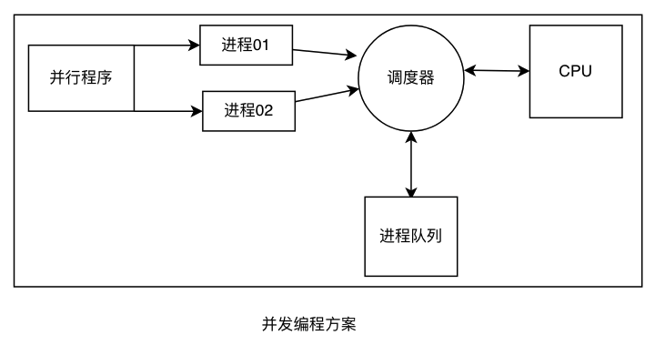
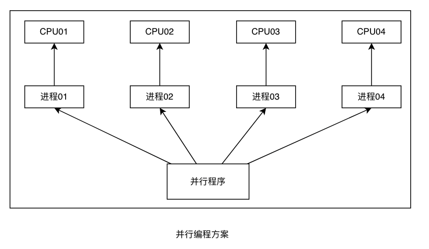
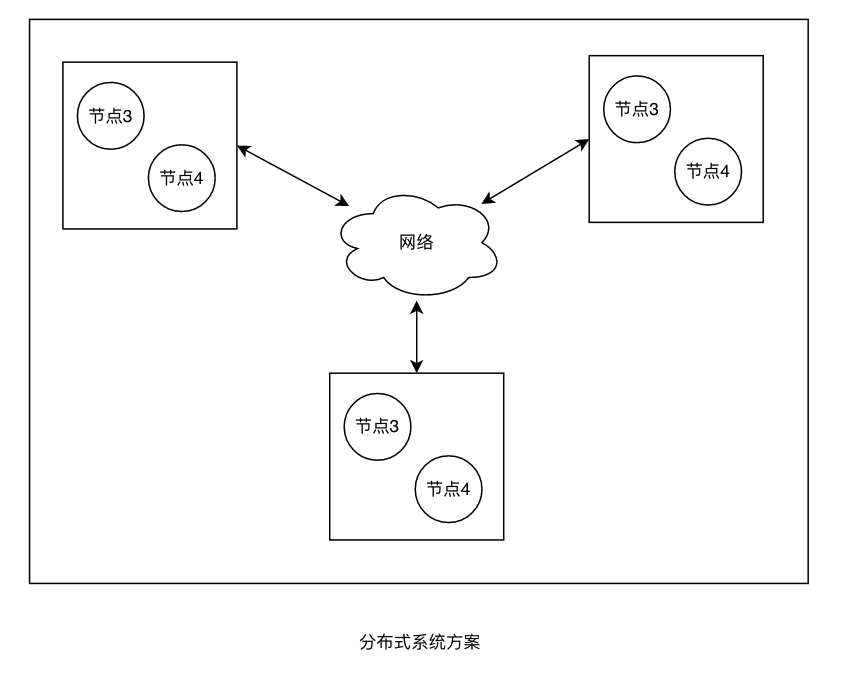

# 探索并行化的几种模式

当我们试图定义**并行系统**的主要方案时，有疑惑很正常。常常会有人提到**并发系统**和**并行系统**，这两个术语看起来像是讲的同一件事。然而实际上有着轻微的差异。

## 并发编程

在**并发编程**中，我们有一个场景，一个程序派发了几个 workers，这些工人争着使用 CPU 来运行一个任务。 在争执发生的阶段由 CPU 调度器控制，其功能是定义在特定时刻哪个 worker 适合使用资源。 在大多数情况下，**CPU** 调度程序运行进程的排序任务非常快，以至于我们可能会产生伪并行的印象。 因此，**并发编程**是**并行编程**的抽象。

!!! info ""

    并行系统争夺同一CPU来运行任务

下图显示了一个**并发编程**方案：

## 并行编程

**并行编程**可以被定义为一种方案，在这种方案中，程序数据创建workers以在多核环境中同时运行特定任务，而无需在他们之间并发访问 CPU。

!!! info ""

    并行系统同时运行任务。

下面的图显示了**并行编程**的概念：

## 分布式编程

**分布式编程**旨在通过在物理上分离的计算机（节点）之间交换数据来共享处理的可能性。

由于多种原因，**分布式编程**变得越来越流行； 他们的探索如下：

* **容错性**(Fault-tolerance)：由于系统是分散的，我们可以将处理分配给网络中的不同机器，从而在不影响整个系统功能的情况下对特定机器进行单独维护。
* **横向扩展**(Horizontal scalability)：一般来说，我们可以增加分布式系统的处理能力。 我们可以连接新设备而无需中止正在执行的应用程序。 可以说，与垂直可扩展性相比，它更便宜、更简单。
* **云计算**：随着硬件成本的降低，我们需要这类业务的增长，我们可以获得以共同合作方式运行的大型机器集群，并以对用户透明的方式运行程序。

> 分布式系统在物理上分离的节点中运行任务。

下图显示了一个分布式系统的方案：

