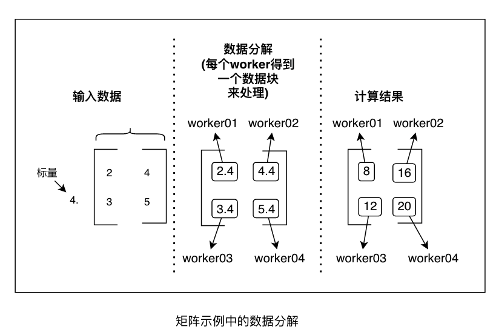

# 使用数据分解

并行化问题的方法之一是通过**数据分解**。想象一下有这么一个场景，在这个场景中我们要以标量4乘以一个2x2矩阵(这个矩阵被称为矩阵A).在一个顺序执行系统中，我们将一个接一个的执行每个乘法的操作，最后生成所有指令的最终结果。根据矩阵A的大小，这个问题的顺序解决方案可能是旷日持久的。然而，当数据分解被应用的时候，我们可以想象矩阵A被分解为一个一个小的部分，这些分片数据被相关的workers以并行的方式接受并处理。下图以一个2x2矩阵乘以一个标量值的例子说明了数据分解应用的概念：

上图中出现的矩阵相乘的问题有一定的对称性，每个必要的操作的结果是由一个单独的worker执行的，而且每个worker执行同样数量的操作来解决问题。然而，在现实世界中，worker的数量和已分解的数据数量的关系是不对称的，这将直接影响解决方案的性能。最后，每个worker所产生的结果必须整合起来以便使程序最终输出意义结果。为了进行这种整合，workers之间需要进行**信息交换**或是**共享状态**。

!!! info ""

    数据分解的粒度选择可能会影响解决方案的性能。
