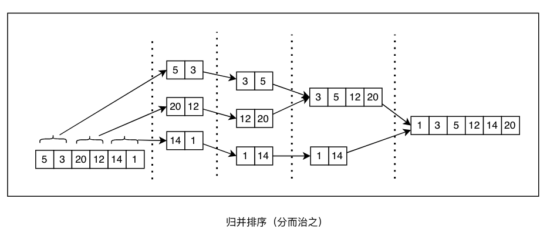

# 分治技术

当你面对一个复杂的问题时，要做的第一件事就是分解问题，以确定可以独立处理的部分。 通常，解决方案中的可**并行化部分**是可以分割和分布式处理的部分，以便由不同的worker处理。 分而治之的技术涉及**递归**地分割**域**(domain)，直到找到并解决完整问题的不可分割的单元。 **归并排序**、**快速排序**等排序算法都可以通过这种方式解决。

下图显示了**归并排序**在六个元素的向量中的应用，可以看到使用了**分而治之技术**：

