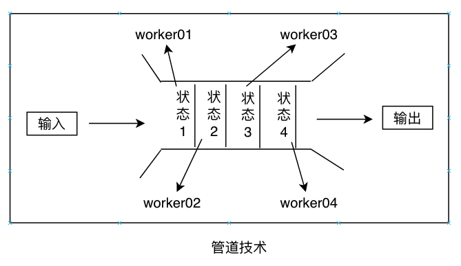

# 用管道分解任务

**管道技术**用于必须以协作方式执行以解决问题而组织任务的一种技术。 **管道**(pipeline)将大型任务分解为以并行方式运行的较小的独立任务。 管道模型可以比作汽车工厂的装配线，其中底盘是输入的原材料。 随着原材料经过不同的生产阶段，几个worker依次执行不同的动作，直到过程结束，这样我们才能准备好汽车。 该模型与开发的顺序范式非常相似； 任务一个接一个地对数据执行，通常，一个任务得到一个输入，这是前一个任务的结果。 那么这个模型与顺序技术有什么区别呢？ 管道技术的每个阶段都有自己的worker，并且他们以并行的方式处理问题。

计算上下文中的一个示例可能是系统批量处理图像并将提取到数据库中的数据持久化。 我们将得到以下事实序列：

* 接受输入的图像并且以对这些图片以并行的方式进行排列，这些图片将在第二阶段进行处理
* 解析图像，并且有用的信息将会被送到第三阶段
* 在第三阶段，过滤器被并行的应用在图像上
* 来自第三阶段的数据结果被保存在数据库中

!!! info ""

    **管道技术**的每个阶段都以独立的方式与自己的worker一起执行。 但是，它建立了数据通信机制，以便可以交换信息。

下图展示了管道的概念：

