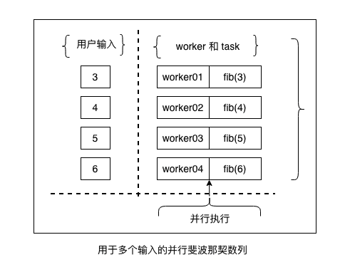

# 从多个输入中得到斐波那契最大的值

众所周知，斐波那契数列被定义如下：

<math xmlns="http://www.w3.org/1998/Math/MathML" display="block"><mi>F</mi><mo stretchy="false">(</mo><mi>n</mi><mo stretchy="false">)</mo><mo>=</mo><mrow data-mjx-texclass="INNER"><mo data-mjx-texclass="OPEN">{</mo><mtable columnspacing="1em" rowspacing="4pt"><mtr><mtd><mn>0</mn><mo>,</mo><mtext>&nbsp;if&nbsp;</mtext><mi>n</mi><mo>=</mo><mn>0</mn></mtd></mtr><mtr><mtd><mn>1</mn><mo>,</mo><mtext>&nbsp;if&nbsp;</mtext><mi>n</mi><mo>=</mo><mn>1</mn></mtd></mtr><mtr><mtd><mi>F</mi><mo stretchy="false">(</mo><mi>n</mi><mo>−</mo><mn>1</mn><mo stretchy="false">)</mo><mo>+</mo><mi>F</mi><mo stretchy="false">(</mo><mi>n</mi><mo>−</mo><mn>2</mn><mo stretchy="false">)</mo><mo>,</mo><mi>if</mi><mi>n</mi><mo>&gt;</mo><mn>1</mn></mtd></mtr></mtable><mo data-mjx-texclass="CLOSE" fence="true" stretchy="true" symmetric="true"></mo></mrow></math>

实际上，按照从0到10计算斐波那契的值，结果将会是0, 1, 1, 2, 3, 5, 8, 13, 21, 34, 和55.

用迭代法计算斐波那契最高的值的Python代码如下:

```python
def fibonacci(input):
    a, b = 0, 1
    for item in range(input):
        a, b = b, a + b
    return a
```

斐波那契函数为一个特定的输入的数据计算一个最大的斐波那契值。让我们想象一个场景，在这个场景中，需要计算斐波那契的值，而本网站将会从一个用户那里接收到几个输入。假设用户提供一个数组的值作为输入，因此使这些计算按顺序将会很有趣。但是假使是100万个用户同时发出请求那么将会怎么样？在这种情况下，一些用户不得不等待很长一段时间才能得到他们的答案。

让我们只考虑先前文中的Python实现的斐波那契函数代码。我们怎么在有一个数组数据输入的情况下使用并行性来实现它？在前一章已经展示过多种实现的方式，这里我们使用其中一种方式-**数据分解**。我们可以将数组分为几个单元，每个单元关联一个任务然后被一个worker执行。下图描述了一个建议的解决方案：



!!! info ""

    作为对读者的建议，请完成实施缓存计算值机制的练习，以避免浪费 CPU 时间。 我们推荐像 [memcached](http://memcached.org/){target="_blank"} 这样的缓存数据库。
