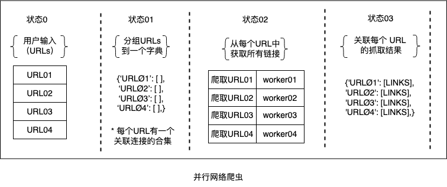

# 爬取网页

本书要研究的另一个问题是并行网络爬虫的实现。 网络爬虫由浏览网络以搜索页面信息的计算机程序组成。 要分析的场景是一个序列网络爬虫由可变数量的**统一资源定位器**(Uniform Resource Locators - URLs)提供的问题，它必须搜索提供的每个 URL 中的所有链接。 假设输入的 URL 数量可能比较多，我们可以通过以下方式规划一个寻找并行性的解决方案：

1. 将所有的**URLs**分成组组合到一个数据结构中。
2. 把这些**URLs**分配給多个任务，这样写任务会爬取每个URL中的包含信息。
3. 将这些任务分派给多个并行的**workers**来执行。
4. 前一阶段的结果必须传递到下一阶段，这将改进原始收集的数据，从而保存它们并将它们与原始 **URL** 相关联。

正如我们在提议的解决方案的编号步骤中所观察到的，存在以下两种方法的组合：

* **数据分解**：这发生在我们划分和关联URLs到任务上。
* **用管道进行任务分解**：这包含三个阶段的管道，这发生在我们**链接接收**、**存储**以及**组织爬取的结果**的任务。

下图显示了解决方案：

