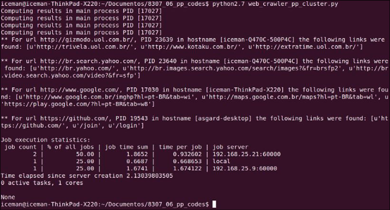
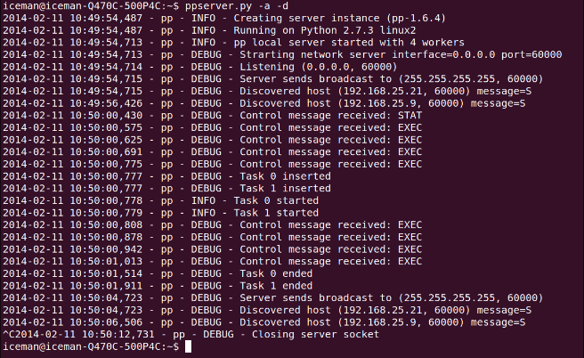
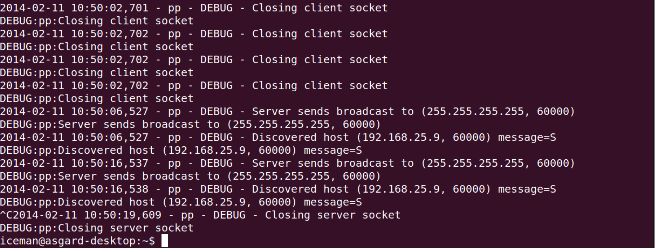

# 使用PP创建分布式网络爬虫

现在我们已经使用 `PP` 并行执行代码来调度本地进程，现在是验证代码是否以分布式方式执行的时候了。 为此，我们将使用以下三台不同的机器：

- Iceman-Thinkpad-X220: Ubuntu 13.10
- Iceman-Q47OC-500P4C： Ubuntu 12.04 LTS
- Asgard-desktop: Elementary OS

我们将在如上列举的三台机器上测试pp组件在分布式环境下的使用。对此，我们实现了分布式网络爬虫。`web_crawler_pp_cluster.py`方法中，将`input_list`列举的URL分发到本地以及远端进程执行，`web_crawler_pp_cluster.py`中的回调函数将组织这些URL以及以及通过它们找到的前三个连接(URL)并进行分组。

让我们逐步分析代码以了解如何找到解决此问题的方法。 首先，我们将`import`必要的模块并定义要使用的数据结构。 与上一节一样，我们将创建一个 `input_list` 和一个包含最终处理结果的字典`result_dict`。 参考以下代码：

```python
import os, re, requests, pp

ppurl_list = ['http://www.google.com/','http://gizmodo.uol.com.br/', 
              'https://github.com/', 'http://br.search.yahoo.com/',    
              'http://www.python.org/','http://www.python.org/psf/']

result_dict = {}
```

现在，我们的 `aggregate_results` 函数将再次成为我们的回调函数，与斐波那契项的示例相比变化不大。 我们只是更改了要插入字典中的消息的格式，以及这个回调的返回将是一个包含执行它的进程的 `PID`、执行它的主机名和找到的前三个链接组成的元组。 参考`aggregate_results`函数如下：

```python
def aggregate_results(result):    
    print("Computing results in main process PID [%d]" % os.getpid())    
    message = "PID %d in hostname [%s] the following links were found: %s" % (result[2], result[3], result[1])    
    result_dict[result[0]] = message
```

下一步是定义 `crawl_task` 函数，它将由 `Server` 类的实例调度。 该功能与前面章节中介绍的功能类似，旨在收集作为参数接收的 `URL` 显示的页面中的现有链接。 唯一的区别是返回是一个元组。 参考以下代码：

```python
def crawl_task(url):    
    html_link_regex = re.compile('<a\s(?:.*?\s)*?href=[\'"](.*?)[\'"].*?>')
    request_data = requests.get(url)    
    
    links = html_link_regex.findall(request_data.text)[:3]    
    return (url, links, os.getpid(), os.uname()[1])
```

在`main`方法和`callback`方法定义之后，我们需要初始化`Server`类实例，以至于能够在分布式环境下执行网络爬虫任务。我们注意到`pp.Server`类有三个参数，第一个参数是执行`Server`类方法的`IP`或`hostname`，我们的例子中，除了本机之外，还需要定义另外两台机器的`IP`和`hostname`，定义如下所示：

```python
ppservers = ("192.168.25.21", "192.168.25.9")
```

!!! info ""

    如果您不想通知并希望自动发现可用于接收任务的机器，请在 `ppservers` 元组中使用 `*` 字符串。

定义标识服务器的元组。 我们将创建一个 `Server` 实例，如下所示：

```python
job_dispatcher = pp.Server(ncpus=1, ppservers=ppservers, socket_timeout=60000)
```

值得注意的是，与前面的示例相比有一些变化。 首先，我们将值 `1` 传递给了 `ncpus` 参数。 这将导致 `PP` 创建单个本地进程，并在必要时将其他任务分派给远程机器。 定义的第二个参数是我们在上一步中创建的服务器的元组。 最后，我们为通信中使用的套接字定义了一个超时值，仅用于测试目的。 目标是避免网络超时而关闭通道。

创建 `Server` 类的实例后，就可以分派我们的函数来执行了。 让我们遍历每个 `URL` 并将它们传递给 `Server` 实例的`submit`方法，如下所示：

```python
for url in ppurl_list:    
    job_dispatcher.submit(crawl_task, (url,),        
        modules=('os', 're', 'requests',),            
        callback=aggregate_results)
```

与之前计算斐波那契数列的示例相比，重要的变化是发送执行所需的模块。

!!! info ""

    你一定在想为什么元组模块中没有传`PP`模块。 很简单; PP 执行环境已经为我们做了这个导入。 毕竟，它需要在远程节点中执行此操作。

为了完成我们的并行和分布式网络爬虫，我们必须等到执行结束才能显示它们的输出。 请注意，最后，`Server` 类的 `print_stats` 方法中有一个新元素，它显示了一些有趣的执行统计信息，如下所示：

```python
job_dispatcher.wait()

print "\nMain process PID [%d]\n" % os.getpid() 
for key, value in result_dict.items():
    print "** For url %s, %s\n" % (key, value)    
    job_dispatcher.print_stats()
```

在执行程序之前，我们需要在远程机器上初始化 `ppserver.py` 实用程序； `ppserver.py –a –d` 是这里使用的命令，其中 `–a` 是自动发现的选项，允许未指定 `IP` 地址的客户端找到服务器。 另一个参数是 `-d`，它通过日志显示有关服务器活动如何执行的信息。

让我们按以下顺序可视化输出：

1. 首先，以下屏幕截图显示了主节点中创建和分发任务的阶段：
    
2. 然后，初始化 `ppservers.py` 服务器并在以下屏幕截图中看到处理任务（从 iceman-Q47OC500P4C 的 `ppserver.py` 输出和从 `asgard-desktop` 的 `ppserver.py` 输出）。
3. 在前面的屏幕截图中，值得注意的是统计信息带来了有趣的信息，例如分配到不同目的地的任务数量、每个任务的时间以及每个目的地的总数。 前面屏幕截图中的另一个相关点是回调函数仅在主进程中执行，即调度任务中的那些。 因此，切记不要让回调任务过重，因为它们可能会消耗主节点的过多资源； 这显然取决于每个案例的具体情况。
4. 下面的截图是的`debug`模式下`ppserver.py`脚本在`iceman-Q470C-500P4C`机器上的的执行日志。

    

5. 下面截图是`debug`模式下`ppserver.py`脚本在`asgard-desktop`机器上的执行日志。
    

## 完整示例

译者注: 由于机器性能原因或网络原因，未能还原作者执行场景。

`fibonacci_pp_cluster.py`

```python
import os, re, requests, pp


ppurl_list = ['http://www.google.com/','http://gizmodo.uol.com.br/', 
              'https://github.com/', 'http://br.search.yahoo.com/',    
              'http://www.python.org/','http://www.python.org/psf/']

result_dict = {}

def aggregate_results(result):    
    print("Computing results in main process PID [%d]" % os.getpid())
    message = "PID %d in hostname [%s] the following links were found: %s" % (result[2], result[3], result[1])    
    result_dict[result[0]] = message

def crawl_task(url):    
    html_link_regex = re.compile('<a\s(?:.*?\s)*?href=[\'"](.*?)[\'"].*?>')
    request_data = requests.get(url)    
    
    links = html_link_regex.findall(request_data.text)[:3]    
    
    return (url, links, os.getpid(), os.uname()[1])


ppservers = ("192.168.25.21", "192.168.25.9")

job_dispatcher = pp.Server(ncpus=1, ppservers=ppservers, socket_timeout=60000)

for url in ppurl_list:    
    job_dispatcher.submit(crawl_task, (url,),        
        modules=('os', 're', 'requests', ),            
        callback=aggregate_results)
    
job_dispatcher.wait()

print("\nMain process PID [%d]\n" % os.getpid())
for key, value in result_dict.items():
    print("** For url %s, %s\n" % (key, value))
    job_dispatcher.print_stats()  # 显示了一些有趣的执行统计信息
```
