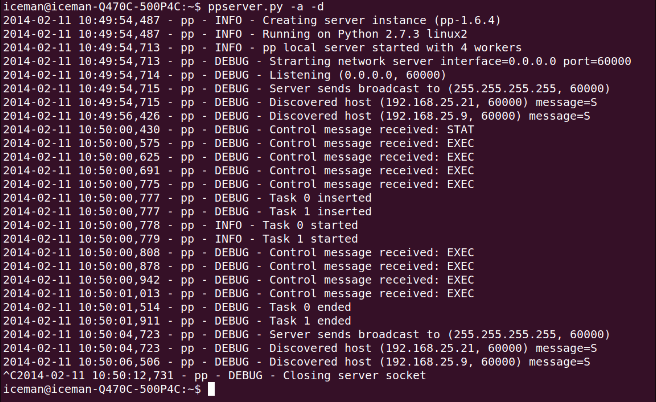

# 使用PP创建分布式网络爬虫

目前我们已经使用pp组件在本机上实现多进程并发，接下来我们将在分布式环境下使用pp组件，分布式硬件环境如下：

- Iceman-Thinkpad-X220: Ubuntu 13.10
- Iceman-Q47OC-500P4C： Ubuntu 12.04 LTS
- Asgard-desktop: Elementary OS

我们将在如上列举的三台机器上测试pp组件在分布式环境下的使用。对此，我们实现了分布式网络爬虫。`web_crawler_pp_cluster.py`方法中，将`input_list`列举的URL分发到本地以及远端进程执行，`web_crawler_pp_cluster.py`中的回调函数将组织这些URL以及以及通过它们找到的前三个连接(URL)。

让我们分析代码，一步步理解怎样实现上述功能。首先`import`使用到的库以及定义数据结构。然后定义`input_list`列表用于存放入口`URL`和`result_dict`存放爬取结果。代码如下所示：

```python
import os, re, requests, 

ppurl_list = ['http://www.google.com/','http://gizmodo.uol.com.br/', 
              'https://github.com/', 'http://br.search.yahoo.com/',    
              'http://www.python.org/','http://www.python.org/psf/']

result_dict = {}
```

接下来分析`aggregate_results`方法，该方法还是作为回调函数，相对于前一小结的`aggreate_results`方法，改变不多。返回`meesage`的格式的发生了变化，`aggregate_resullt`方法的传入参数变成`tuple`，分别保存执行该方法的`PID`号，`hostname`和找到的前三个`URL`。代码如下：

```python
def aggregate_results(result):    
    print "Computing results in main process PID [%d]" % os.getpid()    
    message = "PID %d in hostname [%s] the following links were "\        
    "found: %s" % (result[2], result[3], result[1])    result_dict[result[0]] = message
```

接下来定义`crawl_task`方法，作为`Server`类方法。和之前章节的`crawl_task`方法功能类似，依据传入的`RUL`获取网页上的其他链接(`RUL`),唯一的不同是返回值是`tuple`，代码如下：

```python
def crawl_task(url):    
    html_link_regex = \
        re.compile('<a\s(?:.*?\s)*?href=[\'"](.*?)[\'"].*?>')
    request_data = requests.get(url)    
    
    links = html_link_regex.findall(request_data.text)[:3]    
    return (url, links, os.getpid(), os.uname()[1])
```

在`main`方法和`callback`方法定义之后，我们需要初始化`Server`类实例，以至于能够在分布式环境下执行网络爬虫任务。我们注意到`pp.Server`类有三个参数，第一个参数是执行`Server`类方法的`IP`或`hostname`，我们的例子中，除了本机之外，还需要定义另外两台机器的`IP`和`hostname`，定义如下所示：

```python
ppservers = ("192.168.25.21", "192.168.25.9")
```

!!! info ""

    如果您不想通知并希望自动发现可用于接收任务的机器，请在 ppservers 元组中使用 * 字符串。

`pp.Server`类的初始化如下：

```python
job_dispatcher = pp.Server(ncpus=1, ppservers=ppservers, socket_timeout=60000)
```

我们注意到初始化有三个参数，第一个参数不同的是被赋值为1，使得pp组件创建一个本地进程，如果需要的话，把其他任务转发到远端机器上执行。第二个参数是之前定义的`ppservers`。第三个参数定义`socket`连接超时时间，通常为了测试目的，我们把`timeout`时间设置很长，防止因为网络超时而导致`socket`连接终止。

`Server`类创建之后，我们将遍历`url_list`，并提交`crawl_task`方法。

```python
for url in url_list:    
    job_dispatcher.submit(crawl_task, (url,),        
        modules=('os', 're', 'requests',),            
        callback=aggregate_results)
```

与之前计算斐波那契数列的示例相比，重要的变化是发送执行所需的模块。

!!! info ""

    你一定在想为什么元组模块中没有传PP模块。 很简单; PP 执行环境已经为我们做了这个导入。 毕竟，它需要在远程节点中执行此操作。

为了完成我们的并行和分布式网络爬虫，我们必须等到执行结束才能显示它们的输出。 请注意，最后，`Server` 类的 `print_stats` 方法中有一个新元素，它显示了一些有趣的执行统计信息，如下所示：

```python
job_dispatcher.wait()

print "\nMain process PID [%d]\n" % os.getpid() 
for key, value in result_dict.items():
    print "** For url %s, %s\n" % (key, value)    
    job_dispatcher.print_stats()
```

在执行程序之前，我们需要在远程机器上初始化 `ppserver.py` 实用程序； `ppserver.py –a –d` 是这里使用的命令，其中 `–a` 是自动发现的选项，允许未指定 `IP` 地址的客户端找到服务器。 另一个参数是 `-d`，它通过日志显示有关服务器活动如何执行的信息。

接下来我们定义输出格式：

1. 首先，下面的屏幕显示main节点的执行信息，包括执行和分发远端任务。
    
2. 然后，执行`ppserver.py`脚本，执行任务信息如下屏幕内容所示。
3. 在之前屏幕中，我们打印了有趣的统计信息，包括在远端机器上执行的任务数量，每个人物执行的时间和每个远端机器上的任务总数。截图上反应的另外一个信息是，我们应该限制`callback`函数任务量，因为`callback`函数都是在`main`节点上执行，这可能会成为成为整个系统的瓶颈，当然也取决于不同的应用场景。
4. 下面的截图是的`debug`模式下`ppserver.py`脚本在`iceman-Q470C-500P4C`机器上的的执行日志。

    

5. 下面截图是`debug`模式下`ppserver.py`脚本在`asgard-desktop`机器上的执行日志。
    
