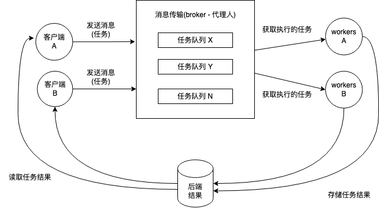

# 理解Celery架构

Celery架构基于**可插拔组件**(pluggable components)和根据选择的**消息传输**（代理）(message transport(broker))协议实现的消息交换机制。下图说明了这一点：



现在，让我们详细的介绍Celery的每个组件。

## 处理任务

在上图中的*client*组件，有创建和分派任务到brokers的方法。

分析如下示例代码来演示通过使用`@app.task`装饰器来定义一个任务，它可以被一个**Celery**应用的实例访问，下面代码展示了一个简单的`Hello World app`：

```python
 @app.task
 def hello_world():
  return "Hello I'm a celery task"
```

!!! info ""

    任何可执行的方法或对象都可以成为任务 (Any callable can be a task.)

正如我们前面提到的，有几种类型的任务：`同步`、`异步`、`定期`和`计划`。 当我们执行任务调用时，它会返回一个 `AsyncResult` 类型的实例。 `AsyncResult` 对象是一个对象，它允许检查任务状态、它的结束，并且很明显，它在存在时返回。 但是，要使用此机制，另一个组件（结果后端）必须处于活动状态。 这将在本章中进一步解释。 要分派任务，我们应该使用任务的以下一些方法：

- `delay(arg, kwarg=value)` : 这是调用 `apply_async` 方法的快捷方式。
- `apply_async((arg,), {'kwarg': value})` : 这允许为任务的执行设置一系列有趣的参数。 其中一些如下：
   - `countdown` : 默认任务是立即执行，该参数设置经过`countdown`秒之后执行。
   - `expires` : 代表经过多长时间终止。
   - `retry` : 此参数决定在连接或发送任务失败的情况下，是否必须重新发送。
   - `queue` : 该任务所处的任务队列。
   - `serializer` : 这表示磁盘中任务序列化的数据格式，一些示例包括 json、yaml 等。
   - `link` : 如果发送的任务成功执行，这将链接一个或多个要执行的任务。
   - `link_error` : 这将在任务执行失败的情况下链接一个或多个要执行的任务。
- `apply((arg,), {'kwarg': value})` : 这会以同步方式在本地进程中执行任务，从而阻塞直到结果准备就绪为止。

!!! info ""

    Celery 还提供了伴随任务状态的机制，这对于跟踪和映射处理的真实状态非常有用。 有关内置任务状态的更多信息，请访问<http://celery.readthedocs.org/en/latest/reference/celery.states.html>{target="_blank"}

## 理解消息转发(broker)

`broker`绝对是 **Celery** 中的关键组成部分。 通过它，我们可以发送和接收消息并与`worker`沟通。 **Celery** 支持大量的代理。 然而，对于其中一些，并不是所有的 `Celery` 机制都得到了实现。 就功能而言最完整的是 `RabbitMQ` 和 `Redis`。 在本书中，我们将使用 `Redis` 作为`broker`和结果后端。 `broker`的功能是在发送任务的客户端应用程序和执行任务的工作线程之间提供一种通信方式。 这是通过使用任务队列完成的。 我们可以有几台带有代理的网络机器等待接收消息以供`workers`使用。

## 理解workers

`Workers`负责执行接收到的任务。**Celery**提供了一系列的机制，我们可以选择最合适的方式来控制`workers`的行为。这些机制如下：

- **并发模式**(Concurrency mode)：例如**进程**、**线程**、**协程**(Eventlet)和**Gevent**。
- **远程控制**(Remote control)：使用这种机制，可以通过高优先级队列发送消息到某个特定的`worker`来改变行为，包括在**运行时**(runtime)。
- **撤销任务**(Revoking tasks)：使用这种机制，我们可以指示一个或多个`worker`忽略一个或多个任务的执行。

如果需要，可以在运行时设置甚至更改更多功能。 比如`worker`在一段时间内执行的任务数，`worker`从哪个`queue`中消耗的时间最多等等。 有关`worker`的更多信息，请访问<http://docs.celeryproject.org/en/latest/userguide/workers.html#remote-control>{target="_blank"}

## 理解result backends

**结果后端**(result backend)组件的作用是存储返回给客户端应用程序的任务的状态和结果。 从 `Celery` 支持的结果后端，比较出彩的有 `RabbitMQ`、`Redis`、`MongoDB`、`Memcached` 等。 前面列出的每个**结果后端**(result backend)都有优点和缺点。 有关详细信息，请参阅 <http://docs.celeryproject.org/en/latest/userguide/tasks.html#task-result-backends>{target="_blank"}。

现在，我们对 `Celery` 架构及其组件有了一个大致的了解。 因此，让我们建立一个开发环境来实现一些例子。
