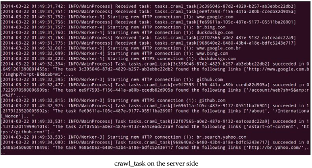

# 用Celery来构建一个分布式网络爬虫系统

现在我们将用`Celery`构建网络爬虫。我们已经有了`webcrawler_queue`，负责`hcrawler`任务。然而，在服务器端，我们将在`tasks.py`模块创建`crawl_task`任务。

首先，导入`re`(正则表达式)和`requests`(HTTP lib)模块，代码如下：

```python
import re
import requests
```

然后，定义正则表达式，和之前的章节一样；

```python
hTML_link_regex = re.compile('<a\s(?:.*?\s)*?href=[\'"][.*?](\'").*?>')
```

然后，替换`crawl_task`方法，添加`@app.task`装饰器，修改返回信息，如下：

```python
@app.task
def crawl_task(url):
    request_data = requests.get(url)
    links = html_link_regex.findall(request_data.text)
    message = "The task %s found the following links %s.." %(url, links)
    return message
```

`links`列表不一定要和下图匹配：


然后让我们再次向上滚动 `Celery` 并查看。 此时，随着我们的新任务加载，是时候在客户端的 `task_dispatcher.py` 模块中实现名为 `crawl_task` 的任务了。

首先，我们需要列出数据的输入`url_list`。代码如下：

```python
url_list = ['http://www.baidu.com',
    'http://cn.bing.com',
    'http://www.qq.com',
    'http://www.github.com',
    ]
```

创建`manage_crawl_task`方法。

```python
def manage_crawl_task(url_list):
    async_result_dict = {url: app.send_task('tasks.crawl_task',
        args=(url,), queue='webcrawler_queue',
        routing_key='webcrawler_queue') for url in url_list}
    for key, value in async_result_dict.items():
        if value.ready():
            logger.info("%s -> %s" % (key, value.get()))
        else:
            logger.info("The task [%s] is not ready" % value.task_id)
```

和之前创建的`manage_fibo_task`方法一样，`async_result_dict`字典包含当前URL和`AsyncResult`结果。然后我们检查任务的状态获取任务结果。

现在我们在`__main__`中调用该方法：

```python

if __name__ == '__main__':
    #manage_sqrt_task(4)
    #manage_fibo_task(input_list)
    manage_crawl_task(url_list)
```

运行`task_dispatcher.py`代码，在服务器端有如下输出：

```shell

```



最后，客户端的输出如下：


**Celery**是一个强大的工具，在本章我们只是用到了基本的东西。更多的内容建议自己在真实的项目中动手去尝试。

## 完整案例

`tasks.py`

```python
from math import sqrt
from celery import Celery
import re
import requests

app = Celery('tasks', broker='redis://localhost/0', backend='redis://localhost/0')
# app.config.CELERY_RESULT_BACKEND = 'redis://192.168.99.89:6379/0'


@app.task
def sqrt_task(value):
    return sqrt(value)

@app.task
def fibo_task(value):
    a, b = 0,1
    for item in range(value):
        a, b = b, a + b
    message = "The Fibonacci calculated with task id %s was %d" % (fibo_task.request.id, a)
    return (value, message)

html_link_regex = re.compile('<a\s(?:.*?\s)*?href=[\'"][.*?](\'").*?>')

@app.task
def crawl_task(url):
    request_data = requests.get(url)
    links = html_link_regex.findall(request_data.text)
    message = "The task %s found the following links %s.." %(url, links)

    return message
```

`tasks_dispatcher.py`

```python
import logging
from celery import Celery
from celery.result import AsyncResult
from typing import Dict

logger = logging.getLogger()
logger.setLevel(logging.DEBUG)
formatter = logging.Formatter('%(asctime)s - %(message)s')

ch = logging.StreamHandler()
ch.setLevel(logging.DEBUG)
ch.setFormatter(formatter)
logger.addHandler(ch)

app = Celery('tasks', broker='redis://localhost/0', backend='redis://localhost/0')

def manage_sqrt_task(value):
    result = app.send_task('tasks.sqrt_task', args=(value,), queue='sqrt_queue', routing_key='sqrt_queue')
    logger.info(result.get())


def manage_fibo_task(value_list):
    async_result_dict: Dict[int, AsyncResult] = {x: app.send_task('tasks.fibo_task',args=(x,), queue='fibo_queue', routing_key='fibo_queue') for x in value_list}

    for key, value in async_result_dict.items():
        if value.ready():
            logger.info("Value [%d] -> %s" % (key, value.get()[1]))
        else:
            logger.info("Task [%s] is not ready" % value.task_id)


def manage_crawl_task(url_list):
    async_result_dict: Dict[str, AsyncResult] = {url: app.send_task('tasks.crawl_task', args=(url,), queue='webcrawler_queue',routing_key='webcrawler_queue') for url in url_list}
    for key, value in async_result_dict.items():
        if value.ready():
            logger.info("%s -> %s" % (key, value.get()))
        else:
            logger.info("The task [%s] is not ready" % value.task_id)

url_list = [
    'http://www.baidu.com',
    'http://cn.bing.com',
    'http://www.qq.com',
    'http://www.github.com',
    'http://br.search.yahoo.com'
]

if __name__ == '__main__':
    input_list = [4, 3, 8, 6, 10]
    # print(manage_sqrt_task(4))
    # print(manage_fibo_task(input_list))
    print(manage_crawl_task(url_list))
```
