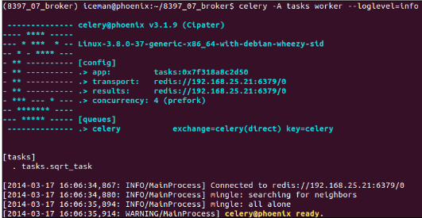
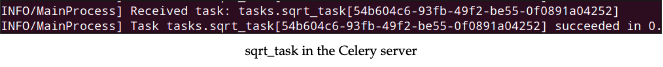
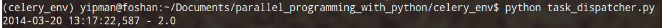

# 分发简单任务

在之前，我们已经建立好环境。下面测试一下环境，发送一个计算平方根的任务。
定义任务模块tasks.py。在开始，导入必须的模块。

```python
 from math import sqrt
 from celery import Celery
```

然后，创建Celery实例，代表客户端应用：

```python
app = Celery('tasks', broker='redis://192.168.25.21:6379/0')
```

在初始化时我们传入了模块的名称和broker的地址。
然后，启动`result backend`，如下：

```python
app.config.CELERY_RESULT_BACKEND = 'redis://192.168.25.21:6379/0'
```

用`@app.tack`装饰器定义任务：

```python
 @app.task
 def square_root(value):
  return sqrt(value)
```

到此，我们完成了tasks.py模块的定义，我们需要初始化服务端的workers。我们创建了一个单独的目录叫做8397_07_broker。拷贝tasks.py模块到这个目录，运行如下命令：

```shell
$celery –A tasks worker –-loglevel=INFO
```

上述命令初始化了**Clery Server**，`—A`代表Celery应用。下图是初始化的部分截图



现在，**Celery Server**等待接收任务并且发送给`workers`。
下一步就是在客户端创建应用调用`tasks`。

!!! info ""

    上述步骤不能忽略，因为下面会用在之前创建的东西。

在客户端机器，我们有**celery_env**虚拟环境，现在创建一个`task_dispatcher.py`模块很简单，如下步骤；

1. 导入logging模块来显示程序执行信息，导入Celery模块：

    ```python
    import logging
    from celery import Celery
    ```

2. 下一步是创建Celery实例，和服务端一样：

    ```python
    #logger configuration...
    app = Celery('tasks', broker='redis://192.168.25.21:6379/0')
    app.conf.CELERY_RESULT_BACKEND = 'redis://192.168.25.21:6397/0'
    ```

由于我们在接下的内容中要复用这个模块来实现任务的调用，下面我们创建一个方法来封装`sqrt_task(value)`的发送，我们将创建`manage_sqrt_task(value)`方法：

```python
def manage_sqrt_task(value):
    result = app.send_task('tasks.sqrt_task', args=(value,))
    logging.info(result.get())
```

从上述代码我们发现客户端应用不需要知道服务端的实现。通过**Celery**类中的`send_task`方法，我们传入`module.task`格式的字符串和以元组的方式传入参数就可以调用一个任务。最后，我们看一看`log`中的结果。
在`__main__`中，我们调用了`manage_sqrt_task(value)`方法：

```python
if __name__ == '__main__':
    manage_sqrt_task(4)
```

下面的截图是执行`task_dispatcher.py`文件的结果：



在客户端，通过`get()`方法得到结果，这是通过`send_task()`返回的`AsyncResult`实例中的重要特征。结果如下图：


