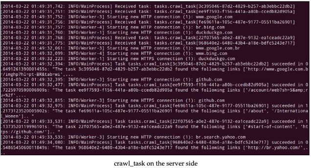

# 用Celery来构建一个分布式网络爬虫系统

现在我们将用Celery构建网络爬虫。我们已经有了webcrawler_queue，负责hcrawler任务。然而，在服务器端，我们将在tasks.py模块创建crawl_task任务。
首先，导入re(正则表达式)和requests(HTTP lib)模块，代码如下：

```python
import re
import requests
```

然后，定义正则表达式，和之前的章节一样；

```python
hTML_link_regex = re.compile(
 '<a\s(?:.*?\s)*?href=[\'"][.*?](\'").*?>')
```

然后，替换crawl_task方法，添加@app.task装饰器，修改返回信息，如下：

```python
 @app.task
def crawl_task(url):
    request_data = requests.get(url)
    links = html_link_regex.findall(request_data.text)
    message = "The task %s found the following links %s.."\
    Return message
```

`links`列表不一定要和下图匹配：


在客户端`task_dipatcher.py`模块实现**crawl_task**调用。

首先，我们需要列出数据的输入`url_list`。代码如下：

```python
url_list = ['http://www.google.com',
    'http://br.bing.com',
    'http://duckduckgo.com',
    'http://github.com',
    'http://br.search.yahoo.com']
```

创建`manage_crawl_task`方法。

```python
def manage_crawl_task(url_list):
    async_result_dict = {url: app.send_task('tasks.crawl_task',
        args=(url,), queue='webcrawler_queue',
        routing_key='webcrawler_queue') for url in url_list}
    for key, value in async_result_dict.items():
        if value.ready():
            logger.info("%s -> %s" % (key, value.get()))
        else:
            logger.info("The task [%s] is not ready" % value.task_id)
```

和之前创建的`manage_fibo_task`方法一样，`async_result_dict`字典包含当前URL和`AsyncResult`结果。然后我们检查任务的状态获取任务结果。

现在我们在`__main__`中调用该方法：

```python

if __name__ == '__main__':
    #manage_sqrt_task(4)
    #manage_fibo_task(input_list)
    manage_crawl_task(url_list)
```

运行`task_dispatcher.py`代码，在服务器端有如下输出：



最后，客户端的输出如下：


**Celery**是一个强大的工具，在本章我们只是用到了基本的东西。更多的内容建议自己在真实的项目中动手去尝试。
