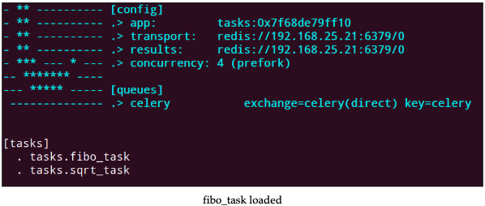
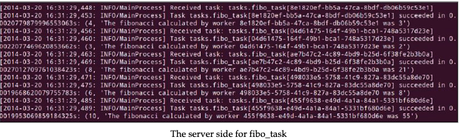
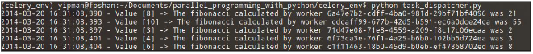

# 使用 Celery 获取斐波那契数列项

让我们再一次计算多个输入的斐波那契数列的项，每个都用分布式的方法。现在的方法和之前的方法改变很小。
我们将终止**Celery**的执行(Ctrl+C)并且在`tasks.py`模块(之前创建过)加入`fibo_task`任务。

```python
@app.task
def fibo_task(value):
    a, b = 0,1
    for item in range(value):
        a, b = b, a + b
    message = "The Fibonacci calculated with task id %s" \
        " was %d" % (fibo_task.request.id, a)
    return (value, message)
```

通过\<task.reaquest.id\>得到任务的ID，请求对象是`task`的对象，task对象提供了`task`执行的上下文。通过上下文可以得到task的ID等信息。

在`tasks.py`模块加入了新的任务之后，再一次初始化**Celery**，结果如下图：



现在我们把`fibo_task`任务装载到**Celery server**，我们将在客户端实现对该任务的调用。

在`task_dispatcher.py`模块，我们会申明`input_list`，如下：

```python
input_list = [4, 3, 8, 6, 10]
```

和前面的做法一样，定义`manage_fibo_task`方法：

```python

def manage_fibo_task(value_list):
    async_result_dict = {x: app.send_task('tasks.fibo_task',
        args=(x,)) for x in value_list}

    for key, value in async_result_dict.items():
        logger.info("Value [%d] -> %s" % (key, value.get()[1]))
```

在`manage_fibo_task`方法中，创建了一个叫做`async_result_dict`的字典，`key`是传入的要计算的值，`value`是`send_task`方法返回的`AyncResult`对象。通过这个方法，我们可以查看任务的结果和状态。

最后，遍历字典得到输入值和输出结果。`AsyncResult`的`get`方法能够得到结果。

`get()`方法会阻塞进程。一个好的方法是调用`ready()`方法来检查结果是否返回了。

上述循环可以修改为如下:

```python
for key, value in async_result_dict.items():
    if value.ready():
        logger.info("Value [%d] -> %s" % (key, value.get()[1]))
    else:
        logger.info("Task [%s] is not ready" % value.task_id)
```

不同的任务会有不同的延迟时间，为了防止无限等待，可以用get(timeout=x)方法设置超时。

最后，添加`manage_fibo_task`的调用，传入`input_list`。代码如下：

```python
if __name__ == '__main__':
    #manage_sqrt_task(4)
    manage_fibo_task(input_list)
```

当我们执行`task_dispatcher.py`后，输入如下：



在客户端有如下输出：


