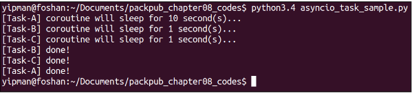
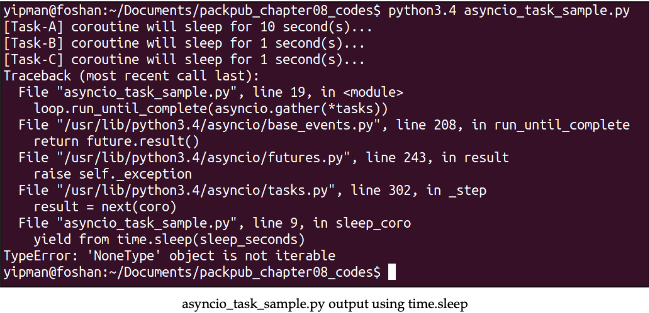
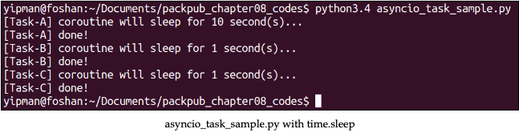
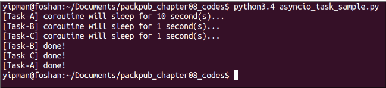

# 使用asyncio

我们可以定义`asyncio`是一个Python中驱动异步编程的模块。ayncio模块使用下列组合来实现异步编程：

- **Event loop**: asyncio模块允许每个进程一个事件循环。
- **Coroutines(协程)**: asyncio的官方文档中指出，`coroutine`是遵循一定规则的发生器。它最吸引人的特点是在执行的时候能够暂停等待外部处理，当外部处理完成后又可以从原来的位置恢复执行。
- **Futures**: Futures代表尚未完成的processing。
- **Tasks**: 是asyncio.Future的子类，用于管理coroutines。

除了这些机制，asyncio还为应用开发提供了很多其他机制，比如传输和协议，可以使用TCP、SSL、UDP和管道进行通信。关于asyncio更多的信息请查看 <https://docs.python.org/3.4/library/asyncio.html>。

## 理解coroutines和rutures

为了在asyncio中定义coroutine，我们使用@asyncio.coroutine装饰器。为了执行一个操作I/O或者其他可能阻塞循环事件的计算，我们必须使用`yield from`语法来暂停coroutine。但是暂停和恢复的机制怎样工作？Coroutine和asyncio.Future对象一起工作。我们可以总结操作如下：

- Coroutine初始化，asyncio.Future在内部实例化或者作为参数传给coroutine。
- 到达coroutine使用yield from的地方，coroutine暂停来等待yield from引发的计算。yield from实例等待yield from\<coroutine or asyncio.Future or asyncio Task\>构建。
- 当yield from引发的计算结束，coroutine执行与coroutine关联的asyncio.Future对象的set_result(\<result\>)方法，通知事件循环coroutine可以被恢复。

### 使用coroutine和asyncio.Future

下面是使用`coroutine`和`asyncio.Future`对象的一些例子：

```python
import asyncio

@asyncio.coroutine
def sleep_coroutine(f):
    yield from asyncio.sleep(2)
    f.set_result("Done!")
```

在上述代码中，定义了一个协程`sleep_coroutine`，它接收一个`asyncio.Future`对象作为参数。在`sleep_coroutine`中，`asyncio.sleep(2)`会让协程睡眠2秒，`asyncio.sleep`已经和`asyncio`兼容。
在主函数中创建`asyncio.Future`对象，创建`event loop`对象。

```python
if __name__ == '__main__':
    future = asyncio.Future()
    loop = asyncio.get_event_loop()
    loop.run_until_complete(sleep_coroutine(future))
```

!!! info ""

    `event loop`执行的时候，任务和协程才会执行。

在最后一行，`loop.run_until_complete(sleep_coroutine(future))`，很明显就是运行直到`sleep_coroutine`结束。

### 使用asyncio.Task

`asyncio.Task`是`asyncio.Future`的子类，目的是管理协程。以下是一个例子，多个`asyncio.Task`将会在事件循环中被创建和分派。

```python
import asyncio

@asyncio.coroutine
def sleep_coro(name, seconds=1):
    print("[%s] coroutine will sleep for %d second(s)…" % (name, seconds))
    yield yfrom asyncio.sleep(seconds)
    print("[%s] done!" % name)
```

`sleep_coro`协程会接收两个参数，`name`用来标识协程，`seconds`用来定义睡眠时间。

在主函数中，定义了一个包含三个`asyncio.Task`对象的列表：

```python
if __name__ == '__main__':
    tasks = [asyncio.Task(sleep_coro('Task-A', 10)),
    asyncio.Task(sleep_coro('Task-B')),
    asyncio.Task(sleep_coro('Task-C'))]
    loop.run_until_complete(asyncio.gather(*tasks))
```

程序的运行结果如下：



值得注意的是，程序的输出表明任务执行的顺序和申明的顺序一致，它们都不能阻塞event loop。

### 使用和asyncio不兼容的库

`asyncio`是`python`新加入的模块，一些库还不能很好的兼容。我们重新实现之前章节的例子`asyncio_task_sample.py`，用`time.sleep`替换`asyncio.sleep`。运行结果如下：



我们可以注意到协程正常初始化，但是由于 `yield from` 语法等待协程或 `asyncio.Future` 而发生错误，并且 `time.sleep` 在其结束时没有生成任何东西。 那么，在这些情况下我们应该如何处理呢？ 答案很简单； 我们需要一个 `asyncio.Future` 对象，然后重构我们的示例。

首先，让我们创建一个函数，该函数将创建一个 `asyncio.Future` 对象以将其返回到 `sleep_coro` 协程中的 `yield from present`。 `sleep_func`函数如下：

```python
def sleep_func(seconds):
    f = asyncio.Future()    
    time.sleep(seconds)    
    f.set_result("Future done!")    
    return f
```

请注意，`sleep_func` 函数在结束时会执行 `f.set_result("Future done!")` 在 `future cause` 中放置一个虚拟结果，因为此计算不会生成具体结果； 它只是一个睡眠功能。 然后，返回一个 `asyncio.Future` 对象，`yield from` 期望它恢复 `sleep_coro` 协程。 以下屏幕截图说明了修改后的 `asyncio_task_sample.py` 程序的输出：



现在所有已分派的任务都执行无误。 可是等等！ 上一个屏幕截图中显示的输出仍然有问题。 请注意，执行顺序内部有些奇怪，因为 **Task-A** 休眠了 10 秒，并在随后两个仅休眠 1 秒的任务开始之前结束。 也就是说，我们的事件循环被任务阻塞了。 这是使用不与 asyncio 异步工作的库或模块的结果。

解决这个问题的方法是将一个阻塞任务委托给`ThreadPoolExecutor`（记住，如果处理是I/O绑定的，这个方法很好用；如果是CPU绑定的，使用`ProcessPoolExecutor`。为了让我们放心，`asyncio`以一种非常简单的方式支持这种机制。让我们再次重构我们的`asyncio_task_sample.py`代码，以便为任务提供执行而不阻塞事件循环。

首先，我们必须删除`sleep_func`函数，因为它不再需要了。对 `time.sleep` 的调用将由 `BaseEventLoop.run_in_executor` 方法完成。然后，让我们以如下方式重构我们的`sleep_coro coroutine`。

```python
@asyncio.coroutine
def sleep_coro(name, loop, seconds=1):    
    future = loop.run_in_executor(None, time.sleep, seconds)

    print("[%s] coroutine will sleep for %d second(s)..." %        (name, seconds))    
    yield from future    
    print("[%s] done!" % name)
```

值得注意的是，`coroutine`接收了一个新的参数，它将是我们在主块中创建的事件循环，这样`ThreadPoolExecutor`就会被用来响应同样的执行结果。

在这之后，我们有以下一行。

```python
future = loop.run_in_executor(None, time.sleep, seconds)
```

在上一行中，对`BaseEventLoop.run_in_executor`函数进行了调用，它的第一个参数是一个执行器（<https://docs.python.org/3.4/library/concurrent.futures.html#concurrent.futures.Executor）。如果它传递的是`None`，它将使用`ThreadPoolExecutor`作为默认。第二个参数是一个回调函数，在本例中是代表我们要完成的计算的`time.sleep`函数，最后我们可以传递回调参数。>

注意，`BaseEventLoop.run_in_executor`方法返回一个`asyncio.Future`对象。然而，从传递返回的`future`开始进行调用收益就足够了，我们的`coroutine`已经准备好了。

记住，我们需要改变程序的主块，将事件循环传递给`sleep_coro`。

```python
if __name__ == '__main__':
    loop = asyncio.get_event_loop()
    tasks = [asyncio.Task(sleep_coro('Task-A', loop, 10)),
             asyncio.Task(sleep_coro('Task-B', loop)),
             asyncio.Task(sleep_coro('Task-C', loop))]
    loop.run_until_complete(asyncio.gather(*tasks))    loop.close()
```

让我们看看下面截图中显示的重构后的代码执行情况。


